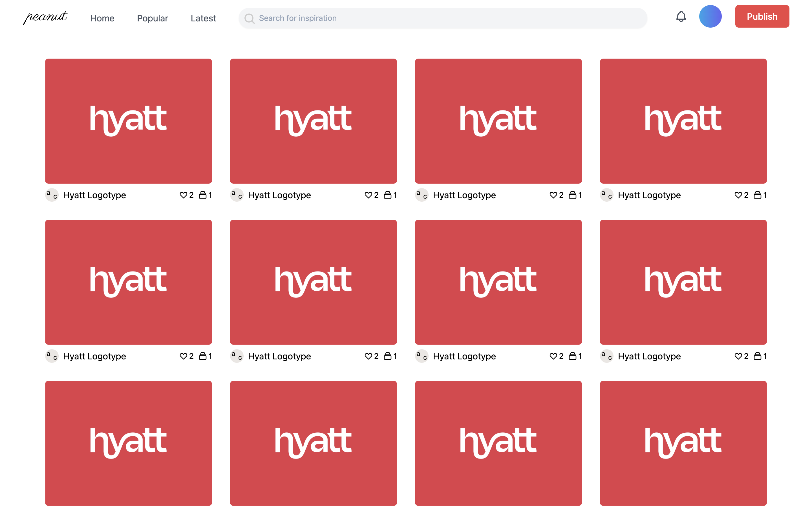
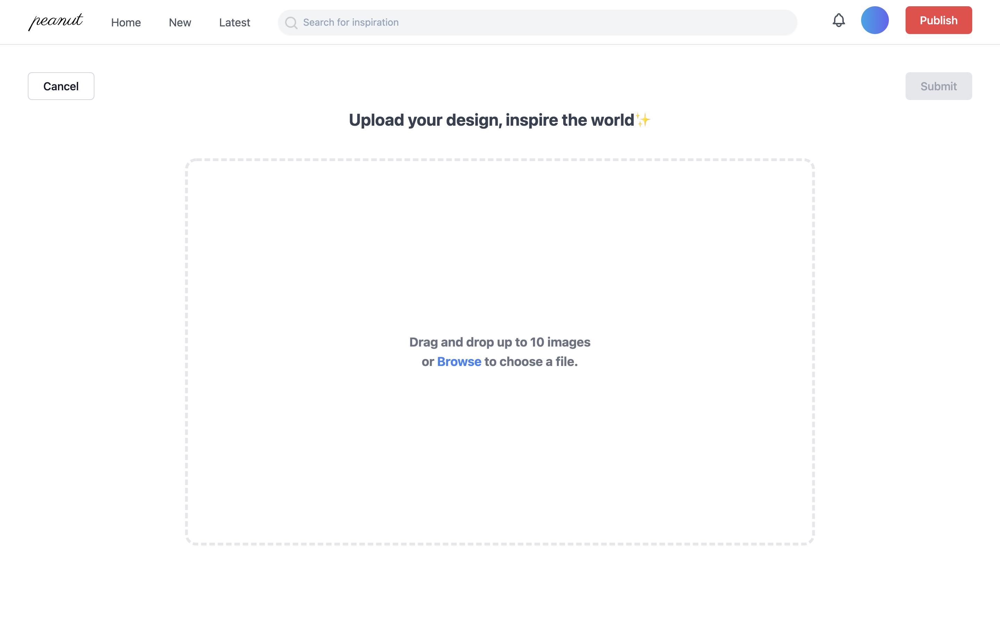
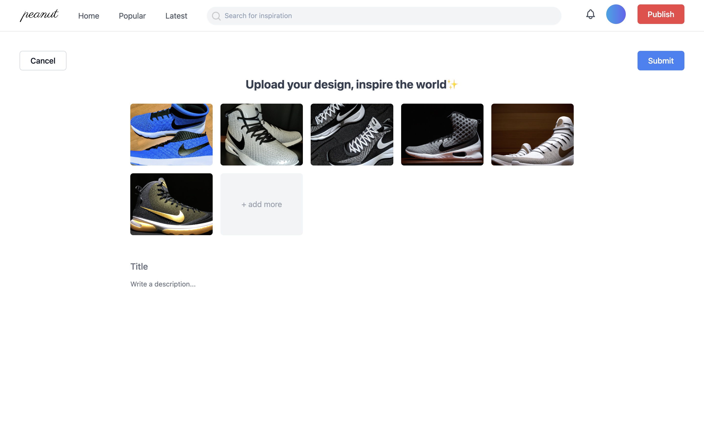
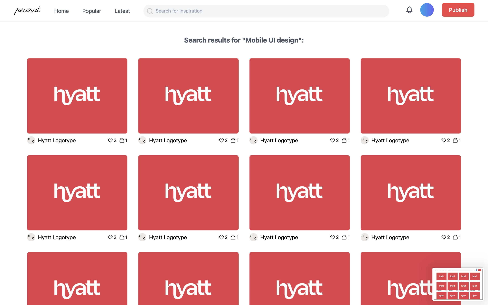

# Peanut-web3-dribbble

### Project Description

Peanut is a social network for designers to share and promote their design and artwork. A user can upload their design and set a price for other users to collect their artwork. The author can optionally choose the collection logic. For example, one option is that once the artwork is collected, the collector will be granted an access to the source file of the design.

### Product Design

I started working on the frontend in VueJS. So below are the screenshots of the current website, to illustrate what the design look like. All images, user profiles are served as a placeholder, only for illustration purpose.

#### 1.Home Page

**Description**

This is the landing page, most users' journey will start here. Before logging in, users will see the popular publications and new publications. After logging in, the user will have see the publications from the accounts they are following.

**User Interactions**

A user can do the following operations:

1. Login and logout
2. Check notifications by clicking the bell icon
3. Explore publications by clicking the menu options in nav bar (Following, Popular, Latest)
4. Go to PublicationDetail page by clicking the cover of the publication
5. Go to Profile Page by clicking the avatar or account name under the cover of each publication
6. Text search

### 2. Publication Detail page

**Description**

This page provides a detailed view of a design. There are informations like title and descrpition, along with related posts. 

**Technical Detail**

The related posts will be provided by a centralized computer vision algorithm (only based on image similarity, so no identity involved). In the next stage (beyond the scope of this grant), these posts will be provided by machine learning algorithm that runs in users browser or based on other decentralized computation.

**User Interactions**

* Like the publication.
* Collect the publication, then user might be provided an address that contains the source file given author's preference. 
* Navigate to similar publications and other users' profile page.
* Go back to previous page.

**Notes**

Comments will be added. (Not reflected in this interface yet.)

### 3. User Profile 

**Description**

This page contains all publications posted or liked by a users.

**User Interactions**

* When users visit other users' profile page, they can follow/unfollow, and check the liked or posted publications.
* When users is visiting their own profile page, they can manage their publications (eg. unlike, delete a publication).

### 4. Uploader Page

**Description**

Users can upload up to 10 images, and add titles and descriptions optionally. Then they will be able to select collection logic.

**Technical Detail**

Images will be uploaded to IPFS using IPFS javascript SDK. If the author choose to provide the source file to the collector, the source files will be encrypted using Lit Protocol, and stored in Ceramic.

**User Interactions**

* Upload up to 10 images, by drag or drop (already achieved) or file selection.
* Add title and description (optional)
* Submit
* Cancel the publish

**Notes**

The UI for selecting collection logic will be added, along with the UI displaying unloked information after a collector collecting a publication.

### 5. Search Page

**Description**

A user can search by typing in the search bar in the header and press enter. The result will be listed as shown above.

**User Interactions**

* Search by text
* Go to publication detail or profile page form the search results.
